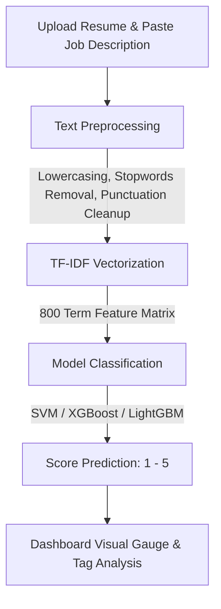

# ML Resume Screener & Job Matcher

<div align="center">
  
  [](https://python.org)
  [](https://streamlit.io)
  [](https://scikit-learn.org)
  [](LICENSE)

  <h3>An end-to-end Machine Learning Pipeline & Interactive Dashboard for Screening Resumes and Matching Job Descriptions.</h3>
</div>

---

## Key Features

* **Glassmorphism Interactive UI**: A premium dark-themed Streamlit dashboard with custom fonts ('Outfit'), responsive components, and micro-animations.
* **Smart Resume Parsing**: Extracts plain text from uploaded **PDF** and **TXT** files dynamically.
* **Semantic TF-IDF Alignment**: Preprocesses both resumes and job descriptions using custom NLTK stopwords filtering, punctuation clearing, and case normalization.
* **Multi-Model Support**: Compares and predicts compatibility ratings (1-5) using three pre-trained machine learning classifiers:
  * **Support Vector Machine (SVM)**
  * **LightGBM Classifier**
  * **XGBoost Classifier**
* **Skills Analysis Matrix**: Instantly flags **Matched Skills** (present in both JD and Resume) and highlights **Missing Skills** (present in JD but missing in Resume) to assist recruiters.
* **Robust Fail-Safe Architecture**: Gracefully isolates model loading. If any system library (like OpenMP) is missing for a specific model, that model is deactivated while keeping the rest of the application completely operational.

---

## The Machine Learning Pipeline



### 1. Preprocessing
Standardizes textual features by stripping punctuation, numbers, and common English stopwords to focus on technical terms and skills.

### 2. Feature Extraction (TF-IDF)
Calculates term frequency-inverse document frequency over the dataset using a deterministic vocabulary capped at `800` max features.

### 3. Classification Models
Learns the matching scale from `1` (Very Poor Match) to `5` (Excellent Match).

---

## Model Performance Benchmarks

Below is a summary of the training metrics across the classifiers evaluated on the dataset:

| Model Name | Accuracy | Precision | Recall | F1-Score | Status |
| :--- | :---: | :---: | :---: | :---: | :---: |
| **LightGBM Classifier** | **0.5605** | **0.5595** | **0.5605** | **0.5552** | Active |
| **Logistic Regression** | 0.5440 | 0.5401 | 0.5440 | 0.5369 | Trained |
| **XGBoost Classifier** | 0.5440 | 0.5369 | 0.5440 | 0.5372 | Active |
| **Support Vector Machine** | 0.5320 | 0.5410 | 0.5320 | 0.5207 | Active |

---

## Local Setup and Launch

### 1. Prerequisites
Ensure you have **Python 3.13+** and **Homebrew** (on macOS) installed.

### 2. Install OpenMP (macOS only)
XGBoost requires the OpenMP runtime library to execute on macOS:
```bash
brew install libomp
```

### 3. Set Up Virtual Environment & Install Dependencies
Navigate to the project directory and run:
```bash
# Create virtual environment
python3 -m venv .venv

# Activate virtual environment
source .venv/bin/activate

# Upgrade pip
pip install --upgrade pip

# Install dependencies (scikit-learn is locked to 1.6.1 for pickle compatibility)
pip install pandas scikit-learn==1.6.1 joblib lightgbm xgboost nltk PyPDF2 fastapi uvicorn python-multipart jinja2 matplotlib seaborn streamlit
```

### 4. Re-fit TF-IDF Vectorizer
Recreate the deterministic TF-IDF vocabulary pickle file matching your training setup:
```bash
python fit_vectorizer.py
```

### 5. Start the Web App
Launch the interactive Streamlit dashboard:
```bash
streamlit run app.py
```
Open your browser and navigate to **[http://localhost:8501](http://localhost:8501)**.
